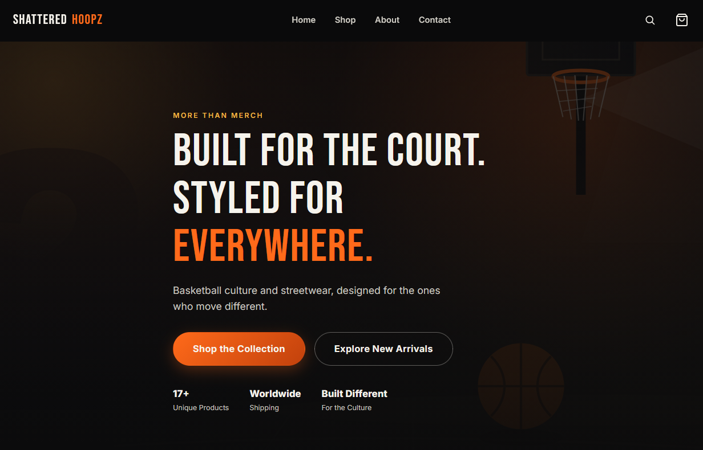

# Shattered Hoopz

<p align="center">
  
</p>

**Interactive Basketball Streetwear Ecommerce Experience**

A frontend ecommerce demo built with vanilla HTML, CSS, and JavaScript — a full product catalog, category/search/sort filtering, a persistent shopping cart, a quick-view modal, wishlist, and a simulated checkout flow, styled as an original basketball/streetwear brand.

> Portfolio/demo project. It simulates a storefront experience end-to-end on the frontend. There is no backend, no real inventory, and no real payment processing anywhere in the codebase.

## Overview

Shattered Hoopz is a fictional basketball-inspired streetwear brand built to demonstrate real frontend engineering: state management, dynamic rendering, localStorage persistence, and interaction design — not just static pages.

## Features

- Premium dark/orange/gold visual identity: cinematic illustrated hero, image-backed category cards, editorial campaign banners
- Dynamic product catalog (17 products across jerseys, hoodies, hats, tees, shorts, and accessories) rendered from structured JS data
- Category filters, live search, and sorting (featured / newest / price / rating), all reflected in the URL for shareable views
- Accessible **quick-view modal** — larger image, quantity selector, Add to Cart, focus trap, Escape-to-close, focus restored to the trigger on close
- **Wishlist** — real localStorage-backed favorites, not decorative UI
- Fully functional cart: add, increment, decrement, remove, clear, live badge count showing total quantity
- Cart persistence via `localStorage` — survives refresh and page navigation
- Free-shipping progress indicator on the cart page
- Simulated checkout ending in a demo order confirmation, which clears the cart and resets the badge
- Client-side contact form validation with an accessible success state
- Nav search that filters straight into the shop page
- Scroll-reveal and micro-interaction animations (card stagger, hover zoom, cart pulse, toast feedback), with `prefers-reduced-motion` support
- Responsive layout verified at 390 / 768 / 1024 / 1440px with zero horizontal overflow
- Accessibility: semantic landmarks, labeled fields, visible focus states, keyboard-operable nav/cart/modal

## Tech Stack

HTML5, CSS3 (custom properties, Grid/Flexbox, no framework), vanilla JavaScript (ES6+, no build step, no dependencies).

## Cart Architecture

`assets/js/cart.js` exposes a single `Cart` object as the source of truth. Storage key: **`shatteredHoopzCart`**. Shape:

```js
[{ productId: "court-statement-jersey", quantity: 2 }, ...]
```

Product ids are stable slugs, used consistently across the shop grid, featured rails, quick view, and cart — the same id always resolves to the same product via `getProductById()` in `products.js`. Product details (name, price, image) are never duplicated into storage; they're looked up live, so the cart always reflects current catalog data. Every mutation (`add`, `increment`, `decrement`, `remove`, `clear`) writes to `localStorage` and dispatches a `cart:updated` event, which any page can listen for to keep its UI in sync (used for the navbar badge everywhere, and the full cart list on `cart.html`).

This flow is covered by an explicit QA script (add two products, refresh, adjust quantities, remove, refresh again, checkout, verify the cart clears) — it was run end-to-end in a real headless browser during development and every step passes.

## Dynamic Product Rendering

Products live as structured data in `assets/js/products.js`:

```js
{
  id: "court-statement-jersey",
  name: "Court Statement Jersey",
  category: "jerseys",
  price: 89.99,
  art: "jersey-black",
  rating: 4.8,
  reviews: 124,
  badge: "NEW",
}
```

`renderProductCard()` in `main.js` turns that data into markup, so the same function powers the homepage's New Arrivals and Best Sellers rails and the full shop grid.

## Filtering, Search & Sort

`shop.js` keeps a small `state` object (`category`, `search`, `sort`), re-derives the visible product list from `PRODUCTS` on every change (never mutating the underlying catalog), and syncs that state into the URL query string.

## Quick View

`modal.js` builds one reusable dialog, injected into the DOM on first use. It traps Tab focus inside the panel, closes on Escape or backdrop click, and restores focus to whatever triggered it.

## Wishlist

A second, simpler localStorage list (`shatteredHoopzWishlist`) tracks favorited product ids independently of the cart, toggled from the heart icon on every product card.

## Demo Checkout

Clicking **Proceed to Checkout** navigates to `thank-you.html`, which calls `Cart.clear()` immediately. **Shop Again** returns to the catalog with an empty cart; **Back to Home** returns to the homepage. No payment form, no processor, and no order is actually created.

## Visual Assets & Licensing Note

This project intentionally contains **no real product photography and no third-party photos**. All product artwork (jerseys, hoodies, caps, bags, etc.), the hero scene, and the campaign banners are original SVG illustrations built for this project, incorporating the fictional Shattered Hoopz branding (SH monogram, number 23, net graphic, wordmark). This is a deliberate choice: an earlier version of this project used scraped official NBA/Nike product photography, which is copyrighted and trademarked and unsuitable for a public portfolio repo. If you want to push the visual fidelity further, the natural next step is swapping `assets/images/products/*.svg` for your own product photography or a licensed asset pack — `products.js` is the only place referencing those filenames.

Shattered Hoopz is an independent, non-commercial portfolio project and is not affiliated with or endorsed by the NBA, Nike, or any sports team or league.

## Responsive Design

Mobile-first CSS Grid/Flexbox layout, tested at 390px, 768px, 1024px, and 1440px: the nav collapses into an accessible hamburger menu, product grids reflow from 4 → 3 → 2 columns, category cards and campaign banners restack, and the cart layout stacks the summary below the item list on narrower screens.

## Accessibility

- Skip-to-content link, landmark elements (`header`, `main`, `footer`, `nav`)
- Labeled form fields with associated error messages
- Visible `:focus-visible` states throughout
- Keyboard-accessible mobile menu and quick-view modal (Escape closes both, focus is trapped/restored correctly in the modal)
- `aria-live` regions for cart quantity and toast notifications
- `prefers-reduced-motion` disables scroll-reveal and other animation

## Project Structure

```
/
  index.html
  shop.html
  about.html
  contact.html
  cart.html
  thank-you.html
  assets/
    css/
      styles.css
    js/
      main.js         # nav, scroll reveal, shared product-card rendering, home rails
      products.js       # product data + lookup helpers
      cart.js             # Cart + Wishlist state (localStorage), badge/toast helpers
      shop.js               # catalog filtering/search/sort
      cart-page.js            # cart.html rendering + quantity controls
      modal.js                 # quick-view dialog
      contact.js                 # contact form validation
    images/
      hero/                       # illustrated hero scene (SVG)
      editorial/                    # campaign banner illustrations (SVG)
      products/                       # original per-product artwork (SVG)
      icons/                             # favicon
  README.md
```

## Running Locally

No build step or dependencies required.

```bash
# Option 1: just open it
open index.html

# Option 2: serve it (recommended)
npx serve .
# or
python3 -m http.server 8080
```

## Deployment

Static site — deploys anywhere that serves static files: Netlify or Vercel (drag-and-drop, no build command), or GitHub Pages from the `main` branch.

## Future Improvements

- Swap illustrated product art for real photography or a licensed asset pack
- Dedicated product detail pages (in addition to quick view) with size selection
- A wishlist page (currently the data is tracked but not yet surfaced as its own view)
- Real backend integration (auth, persistent orders, a real payment provider) if this ever became a live store

## Author

**Iqra Zahid**

- Portfolio: [iqrazahid.netlify.app](https://iqrazahid.netlify.app)
- GitHub: [github.com/Iqra-Z](https://github.com/Iqra-Z)
- LinkedIn: [linkedin.com/in/iqrazahid](https://www.linkedin.com/in/iqrazahid)
